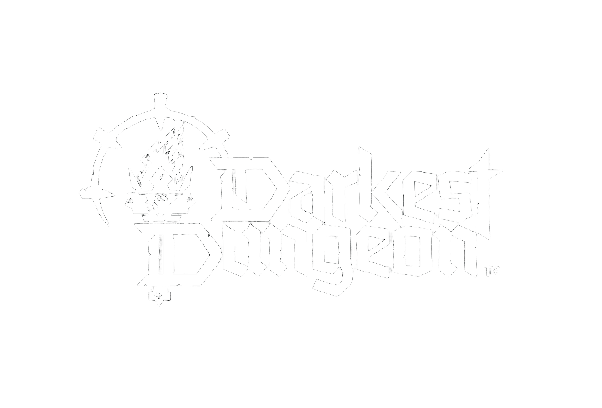
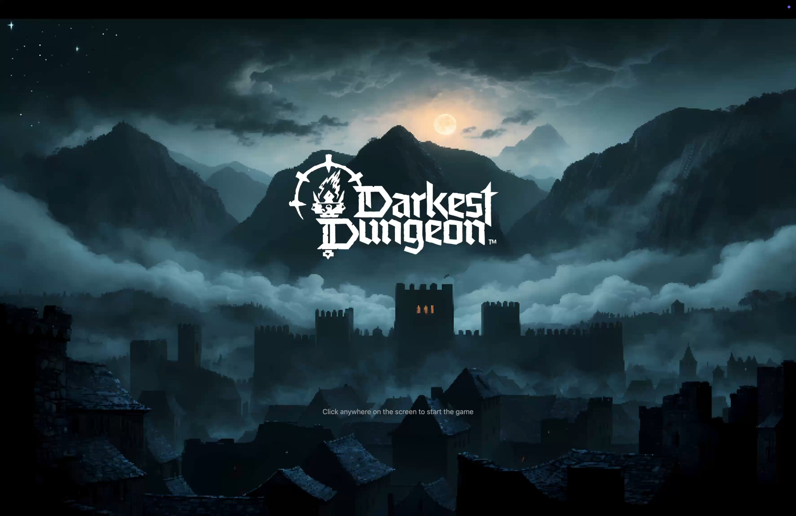
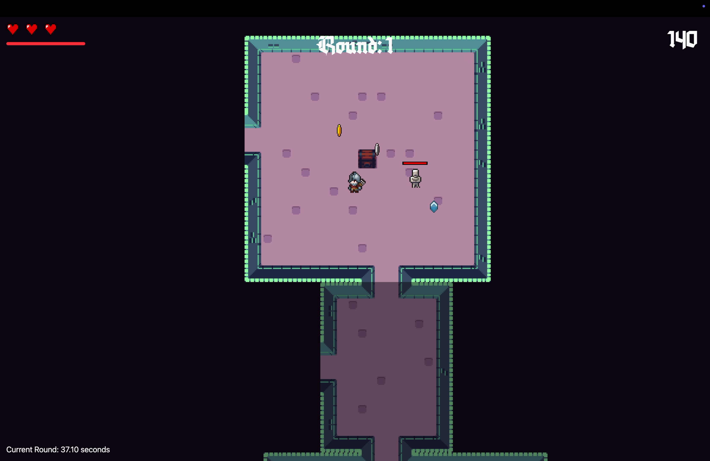
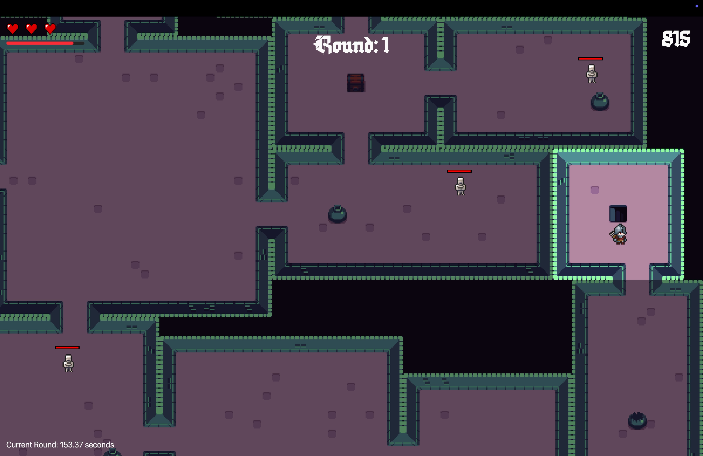

<p align="center">
</p>

Welcome to Darkest Dungeon, an infinite procedural dungeon-crawling adventure where danger lurks around every corner! 🧙‍♂️⚔️ Explore mysterious dungeons, collect treasures, defeat fearsome enemies, and race to find the stairs to escape to the next level! But beware—each level gets harder, and you only have 3 lives. Can you survive the darkness and climb to glory?

💰 Earn as You Play! The core you collect in the game can be minted into Dungeon Tokens ($DGN), making every adventure not just thrilling but also rewarding! 🚀🔥

## ⚙️ How It Works

### 🕹️ Gameplay Mechanics

- **Randomly Generated Dungeons**: Each playthrough offers a fresh dungeon layout. No two games are the same!
- **Enemies**:
  - Skeletons: Common foes with average stats.
  - Archers: Dangerous enemies with long-range attacks, higher HP, and higher damage per second (DPS).
- **Loot System**: Collect coins to increase your score and HP. Coins come in various forms:
  - 🪙 Silver
  - 🟡 Gold
  - 🟢 Emerald
  - 🔴 Ruby
  - 💠 Diamond

### 🎮 Objective

Explore rooms, defeat enemies, and find the stairs to advance to the next level. With each new level, the dungeon grows larger, enemies get tougher, and the stakes get higher!

### 🔥 Scoring System

- Defeat enemies to boost your score.
- Collect rare loot for extra points and perks.
- 💀 3 Lives: When your three lives are up, Game Over! Save your scores and records on-chain to earn perks for future runs.

---

## 🛠️ Built for Swell Chain Hackathon

This game is built for the Swell Chain Hackathon using modern tools and Web3 integrations. Here’s what powers the dungeon:


- On-Chain Features: Store scores and timer data on-chain, unlocking special perks for future playthroughs.
- Minting the score in form of Token Dungeon(DGN)

Chainid[1924]
Contracts are deployed at [0xa17bcF740CAde9A884C6559ba28bC2d494A6C0AD](https://swell-testnet-explorer.alt.technology/address/0xa17bcF740CAde9A884C6559ba28bC2d494A6C0AD) on Swell Testnet. Chainid[1924]
Contract Token Dungeon at [0x56f94D169d2971f74e99776d40670C7Fcc075022](https://swell-testnet-explorer.alt.technology/address/0x56f94D169d2971f74e99776d40670C7Fcc075022) on Swell Testnet.

---

## 🌟 Future Scope

🔮 Our journey doesn't stop here! Planned future features include:

- Multiplayer Mode: Team up or compete with friends in the dungeon.
- Boss Fights: Face epic enemies with unique mechanics.
- More Loot, More Enemies, More Challenges: Expand the dungeon universe with richer gameplay.

## Screenshots 📸

<table>
  <tr>
    <td valign="top" width="50%">
      <br>
      
    </td>
    <td valign="top" width="50%">
      <br>
      
    </td>
  </tr>
</table>

<table>
  <tr>
    <td valign="top" width="50%">
      <br>
            
    </td>
    <td valign="top" width="50%">
      <br>
            
    </td>
  </tr>
</table>

<table>
  <tr>
    <td valign="top" width="50%">
      <br>
            
    </td>
  </tr>
</table>

## 🎥 Demo Video

[](https://www.youtube.com/watch?v=2VlGgsQEdEk)

## Get Started 🚀

The following repository is a turborepo and divided into the following:

- **apps/web** - The web application built using VITE.

First install the dependencies by running the following:

```

pnpm install


Then run the following command to start the application:

```bash
pnpm dev
```

Happy Crawling! 🚪💎

---
